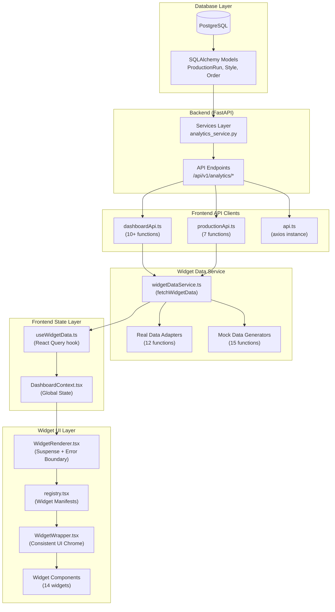

# Data Flow Analysis: Database → Frontend Widgets

> **Purpose**: This document provides a comprehensive analysis of data flow from the database to frontend widgets in FactoryExcelManager. It is intended for a stronger AI agent to analyze and provide recommendations for consistency, simplification, and optimization.

---

## Executive Summary

The FactoryExcelManager dashboard has **three distinct data flow patterns** that evolved over time, creating inconsistency. The current architecture is a **hybrid V1/V2 system** with complexity in:
1. **Multiple API client layers** (`dashboardApi.ts`, `productionApi.ts`) with overlapping responsibilities
2. **A "Switchboard" pattern** in `widgetDataService.ts` that duplicates routing logic
3. **Inconsistent filter propagation** across widgets
4. **Mixed schema validation** (some widgets use Zod, others don't)

---

## Architecture Diagram



---

## Layer-by-Layer Analysis

### 1. Database Layer

**File**: `backend/app/models/production.py`

**Key Models**:
| Model | Description | Key Fields |
|-------|-------------|------------|
| `ProductionRun` | Daily production records | `actual_qty`, `planned_qty`, `worked_minutes`, `earned_minutes`, `sam`, `dhu` |
| `Order` | Purchase orders | `style_id`, `po_number`, `quantity_ordered`, `quantity_shipped` |
| `Style` | Garment style master | `style_number`, `base_sam`, `buyer` |

> [!WARNING]
> **Inconsistency #1**: Field naming is `snake_case` in the database but some frontend components expect `camelCase` (e.g., `styleNumber` vs `style_number`).

---

### 2. Backend Services Layer

**File**: `backend/app/services/analytics_service.py`

**Key Class**: `AnalyticsService`

Core calculation methods:
- `calculate_earned_minutes(produced_qty, sam)` → `units * SAM`
- `calculate_efficiency(earned, available)` → Weighted ratio
- `get_complexity_analysis()` → Returns `[{ name, sam, efficiency, volume }]`
- `get_target_realization()` → Returns `{ actual, target, percentage, delta }`

> [!IMPORTANT]
> **Inconsistency #2**: `get_complexity_analysis()` returns field `name` but frontend expects `style_number`. This requires mapping in `widgetDataService.ts`.

---

### 3. API Endpoints Layer

**File**: `backend/app/api/v1/endpoints/analytics.py`

**17 endpoints** with inconsistent parameter handling:

| Endpoint | Common Params | Notes |
|----------|---------------|-------|
| `/overview` | `line_id` | Returns aggregated stats |
| `/production-chart` | `line_id` | Returns `{ nodes: [] }` |
| `/complexity` | `start_date`, `end_date` | No `line_id` support! |
| `/realization` | `line_id` | Daily target vs actual |
| `/workforce` | `line_id` | Attendance stats |
| `/downtime` | `line_id` | Blocker reasons |

> [!CAUTION]
> **Inconsistency #3**: `/complexity` endpoint doesn't follow the same `FilterParams` pattern as other endpoints. It uses `start_date`/`end_date` instead of `date_from`/`date_to`.

---

### 4. Frontend API Clients

**Two separate files with overlapping responsibilities:**

#### `dashboardApi.ts` (Primary Analytics)
```typescript
// Key functions:
getOverviewStats(params: FilterParams) → OverviewStats
getProductionChart(params: FilterParams) → ProductionChartData
fetchComplexityAnalysis(params: FilterParams) → ComplexityPoint[]
getTargetRealization(params: FilterParams) → RealizationStats
getDowntimeReasons(params: FilterParams) → DowntimeReasonsResponse
```

#### `productionApi.ts` (CRUD + Some Analytics)
```typescript
// Key functions:
getProductionRuns(filters: ProductionRunFilters) → ProductionRun[]
getDhuTrend(lineId?: string) → { date, dhu }[]
getStyleProgress(lineId?: string) → StyleProgressItem[]
getSamPerformance(lineId?: string) → SamPerformanceData
getWorkforceStats(lineId?: string) → WorkforceStats
```

> [!WARNING]
> **Inconsistency #4**: `dashboardApi.ts` uses `FilterParams` object, while `productionApi.ts` uses individual `lineId` parameters. This creates confusion about which client to use.

#### `FilterParams` Interface:
```typescript
interface FilterParams {
    line_id?: string;
    date_from?: string;   // YYYY-MM-DD
    date_to?: string;     // YYYY-MM-DD
    shift?: string;
    limit?: number;
}
```

---

### 5. Widget Data Service ("The Switchboard")

**File**: `frontend/src/features/dashboard/services/widgetDataService.ts` (651 lines)

This is the **central routing layer** that maps `dataId` to either real data adapters or mock generators.

#### Flow:
```
fetchWidgetData(widgetId, filters, settings, productionLineId)
    ↓
Lookup WidgetManifest by ID or dataId
    ↓
Extract filterSubscription (opt-in filters)
    ↓
Build apiParams from GlobalFilters (only subscribed filters)
    ↓
If productionLineId exists → Call Real Data Adapter
Else → Return Mock Data
```

#### Real Data Adapters (12):
| Adapter | dataId | API Used |
|---------|--------|----------|
| `fetchRealProductionData` | `production_hourly` | `productionApi.getProductionRuns` |
| `fetchRealEfficiencyData` | `efficiency_trend` | `dashboardApi.getOverviewStats` |
| `fetchComplexityAnalysis` | `complexity_impact` | `dashboardApi.fetchComplexityAnalysis` |
| `fetchRealRealization` | `realization_kpi` | `dashboardApi.getTargetRealization` |
| `fetchRealDhuQuality` | `dhu_quality` | `productionApi.getDhuTrend` |
| `fetchRealWorkforce` | `workforce_stats` | `productionApi.getWorkforceStats` |
| `fetchRealTimeline` | `production_timeline` | `productionApi.getHourlyProduction` |
| `fetchRealStyleProgress` | `style_progress` | `productionApi.getStyleProgress` |
| `fetchRealSamPerformance` | `sam_performance` | `productionApi.getSamPerformance` |
| `fetchRealEarnedMinutes` | `earned_minutes` | `dashboardApi.getEarnedMinutesStats` |
| `fetchRealDowntimeData` | `downtime_reasons` | `dashboardApi.getDowntimeReasons` |

#### Mock Data Generators (15):
Same list but prefixed with `get*Data` instead of `fetchReal*`.

> [!CAUTION]
> **Inconsistency #5**: The switchboard has a massive `switch` statement with **duplicated routing logic** for both:
> - Real adapters (lines 549-592)
> - Mock generators (lines 599-635)
>
> Any new widget requires adding cases to BOTH switches.

> [!WARNING]
> **Inconsistency #6**: Some adapters call `dashboardApi.*` and others call `productionApi.*`. There's no clear reasoning for which is used when.

---

### 6. useWidgetData Hook

**File**: `frontend/src/features/dashboard/hooks/useWidgetData.ts`

**Pattern**: Wraps `fetchWidgetData` in React Query with:
- Cache key based on `[dataId, filters, settings, productionLineId, lastRefreshAt]`
- Optional Zod validation via `schema` parameter
- Optional auto-polling via `refetchInterval`

#### V1 vs V2 Signatures:
```typescript
// V1 (Legacy)
useWidgetData(dataId, filters, settings, productionLineId)

// V2 (Options Object)
useWidgetData({ dataId, filters, settings, productionLineId, schema, refreshInterval })
```

> [!IMPORTANT]
> **Inconsistency #7**: Both V1 and V2 signatures are supported simultaneously, creating complexity in the argument normalization logic (lines 54-77).

---

### 7. DashboardContext

**File**: `frontend/src/features/dashboard/context/DashboardContext.tsx`

**Responsibilities** (too many):
1. Widget layout state (`layout`, `setLayout`)
2. Widget configuration (`widgets`, `setWidgets`)
3. Global filters (`globalFilters`, `updateDateRange`, `updateShift`)
4. Refresh management (`lastRefreshAt`, `triggerRefresh`)
5. Panel UI state (`activePanel`, `openSettings`, `closePanels`)
6. Widget editing (`editingWidgetId`, `updateWidgetSettings`)
7. Metadata (`productionLineId`, `dataSourceId`)
8. Persistence to localStorage

> [!WARNING]
> **Inconsistency #8**: `DashboardContext` violates single-responsibility principle. It's simultaneously a state manager, filter broadcaster, persistence layer, and UI state controller.

#### GlobalFilters Shape:
```typescript
interface GlobalFilters {
    dateRange: { start: Date; end: Date };
    shift: string; // 'ALL' | 'Morning' | 'Evening' | 'Night'
}
```

---

### 8. Widget Registry

**File**: `frontend/src/features/dashboard/registry.tsx` (695 lines)

**Widget Manifest Structure**:
```typescript
interface WidgetManifest<T> {
    id: string;
    meta: { title, description, category, tags, priority };
    layout: { w, h, minW, minH };
    component: LazyExoticComponent;
    settingsSchema: ZodSchema<T>;
    dataSchema?: ZodSchema<any>;  // Optional V2
    initialSettings: T;
    dataId?: string;              // Links to widgetDataService
    requirements?: { rawColumns?, computedMetrics? };
    filterSubscription?: {        // Opt-in filter system
        dateRange?: boolean;
        shift?: boolean;
        productionLine?: boolean;
    };
    version: number;
    migrations?: Record<number, (settings) => any>;
}
```

#### 14 Registered Widgets:

| ID | dataId | Category | V2? |
|----|--------|----------|-----|
| `production-chart` | `production_hourly` | Efficiency | ✅ |
| `line-efficiency` | `efficiency_kpi` | Efficiency | ✅ |
| `target-realization` | `realization_kpi` | Efficiency | ❌ |
| `earned-minutes` | `earned_minutes` | Efficiency | ❌ |
| `production-timeline` | `production_timeline` | Efficiency | ❌ |
| `sam-performance` | `sam_performance` | Efficiency | ❌ |
| `dhu-quality` | `dhu_history` | Quality | ✅ |
| `speed-quality` | `speed_quality_scatter` | Quality | ❌ |
| `complexity-impact` | `complexity_impact` | Quality | ❌ |
| `blocker-cloud` | `downtime_reasons` | Operations | ❌ |
| `style-progress` | `style_progress` | Operations | ❌ |
| `upload-history` | `upload_history` | Operations | ❌ |
| `workforce-attendance` | `workforce_stats` | Workforce | ❌ |
| `kpi-summary` | `kpi_summary` | Efficiency | ✅ |

> [!NOTE]
> **Inconsistency #9**: Only 4/14 widgets have `dataSchema` defined (marked V2). The rest rely on unvalidated data.

---

### 9. Widget Component Pattern

**V2 "Dumb" Widget Example** (`ProductionChart.tsx`):
```typescript
const ProductionChart: React.FC<SmartWidgetProps<DataProps, ProductionSettings>> = ({
    data,     // Already fetched & validated
    settings, // From widget config
    w, h      // Grid dimensions
}) => {
    const chartData = data?.nodes || [];
    return <AreaChart data={chartData} ... />;
};
```

**SmartWidgetProps Interface**:
```typescript
interface SmartWidgetProps<TData, TSettings> {
    id?: string;
    data: TData;
    isLoading: boolean;
    error: string | null;
    isMock: boolean;
    settings: TSettings;
    globalFilters: GlobalFilters;
    w: number;
    h: number;
    editMode?: boolean;
    onRemove?: () => void;
}
```

> [!IMPORTANT]
> **Inconsistency #10**: `SmartWidgetProps` includes `isLoading` and `error`, but V2 "dumb" widgets shouldn't need these since the renderer handles them. The props interface is overloaded.

---

## Key Inconsistencies Summary

| # | Issue | Location | Impact |
|---|-------|----------|--------|
| 1 | `snake_case` vs `camelCase` field naming | Models → Widgets | Data mapping needed in adapters |
| 2 | API returns `name`, widget expects `style_number` | `analytics_service.py` → `SpeedQualityWidget` | Manual mapping in switchboard |
| 3 | `/complexity` uses different param names | `analytics.py` | Special handling needed |
| 4 | Two API clients with different param patterns | `dashboardApi.ts`, `productionApi.ts` | Confusion, duplicated fetching |
| 5 | Dual switch statements in switchboard | `widgetDataService.ts` | 2x maintenance for new widgets |
| 6 | Mixed API client usage in adapters | `widgetDataService.ts` | No clear pattern |
| 7 | V1/V2 hook signatures | `useWidgetData.ts` | Complex normalization code |
| 8 | Context has too many responsibilities | `DashboardContext.tsx` | Hard to test, maintain |
| 9 | Only 4/14 widgets have Zod validation | `registry.tsx` | Inconsistent type safety |
| 10 | Overloaded `SmartWidgetProps` | `config.ts` | V2 widgets get unused props |

---

## Filter Flow Deep Dive

### Current Filter Propagation Path:

```
User changes date in DashboardFilterBar
    ↓
updateDateRange(range) in DashboardContext
    ↓
setGlobalFilters(prev => ({ ...prev, dateRange: { start, end } }))
    ↓
useWidgetData detects globalFilters change via queryKey
    ↓
React Query triggers re-fetch
    ↓
fetchWidgetData() builds apiParams based on filterSubscription
    ↓
If widget subscribes to dateRange → params include date_from/date_to
If widget doesn't subscribe → filters ignored
    ↓
API call with filtered params
```

### Widget Filter Subscriptions (from registry):

| Widget | dateRange | shift | productionLine |
|--------|-----------|-------|----------------|
| production-chart | ✅ | ❌ | ✅ |
| line-efficiency | ✅ | ✅ | ✅ |
| target-realization | ✅ | ✅ | ❌ |
| dhu-quality | ✅ | ✅ | ✅ |
| speed-quality | ✅ | ✅ | ❌ |
| blocker-cloud | ✅ | ✅ | ❌ |
| kpi-summary | ✅ | ✅ | ✅ |

> [!WARNING]
> **Problem**: Widgets that don't subscribe to `productionLine` may still make API calls that require it, falling back to mock data unexpectedly.

---

## Recommendations for Simplification

### 1. Unify API Client Layer
- Merge `dashboardApi.ts` and `productionApi.ts` into a single `analyticsApi.ts`
- Standardize all functions to accept `FilterParams`
- Remove raw `lineId` parameters

### 2. Simplify Switchboard Pattern
- Replace dual switch statements with a **registry-driven approach**:
```typescript
const ADAPTERS = {
    'production_hourly': { real: fetchRealProductionData, mock: getProductionData },
    'efficiency_trend': { real: fetchRealEfficiencyData, mock: getEfficiencyData },
    // ...
};

const adapter = ADAPTERS[dataId];
if (productionLineId && adapter.real) {
    return { data: await adapter.real(apiParams), isMock: false };
}
return { data: adapter.mock(filters), isMock: true };
```

### 3. Standardize Field Naming
- Enforce `snake_case` from API to widget
- Let widgets handle display formatting (e.g., `formatStyleNumber()`)
- Remove mapping logic from adapters

### 4. Complete V2 Migration
- Add `dataSchema` to remaining 10 widgets
- Simplify `SmartWidgetProps` to remove V1 cruft
- Remove V1 signature support from `useWidgetData`

### 5. Split DashboardContext
- `LayoutContext` → Grid state only
- `FilterContext` → Global filters only
- `WidgetConfigContext` → Widget settings
- `PersistenceService` → localStorage handling (not a context)

### 6. Enforce Backend Consistency
- Standardize all endpoints to use `date_from`/`date_to` (not `start_date`/`end_date`)
- Always include `line_id` support
- Return consistent field names (document in OpenAPI schema)

---

## File Reference

| Layer | Key Files |
|-------|-----------|
| **Database Models** | `backend/app/models/production.py` |
| **Backend Services** | `backend/app/services/analytics_service.py` |
| **API Endpoints** | `backend/app/api/v1/endpoints/analytics.py` |
| **API Clients** | `frontend/src/lib/dashboardApi.ts`, `productionApi.ts`, `api.ts` |
| **Data Switchboard** | `frontend/src/features/dashboard/services/widgetDataService.ts` |
| **State Context** | `frontend/src/features/dashboard/context/DashboardContext.tsx` |
| **Data Hook** | `frontend/src/features/dashboard/hooks/useWidgetData.ts` |
| **Widget Registry** | `frontend/src/features/dashboard/registry.tsx` |
| **Type Definitions** | `frontend/src/features/dashboard/config.ts` |
| **UI Wrapper** | `frontend/src/features/dashboard/components/WidgetWrapper.tsx` |
| **Widgets** | `frontend/src/features/dashboard/widgets/*.tsx` (14 files) |

---

*Analysis generated for AI agent review. Data collected from live codebase on 2026-01-04.*
