# Widget Data Flow: Forensic Lifecycle Analysis

> **Document Type**: Architectural Audit Report  
> **Date**: 2026-01-04  
> **Scope**: Tracing a single data point from Excel upload to UI Widget rendering

---

## Executive Summary

This document provides a **forensic analysis** of the Widget Data Flow in FactoryExcelManager, tracing the complete lifecycle of a data point (e.g., `actual_qty: 150`) from the moment a user uploads an Excel file to its final rendering in a UI Widget.

The system uses a **4-stage HITL (Human-in-the-Loop) ingestion pipeline** with optimized bulk processing, feeding into a **React Query-powered widget rendering layer** with Zod schema validation and mock data fallback.

---

## Data Flow Diagram

```mermaid
flowchart TB
    subgraph Stage1 ["1. Ingestion & Parsing"]
        Upload["📤 User Uploads Excel"]
        Upload --> Validate["File Validation<br/>(type, size, hash)"]
        Validate --> Parse["Pandas read_excel<br/>+ Header Detection"]
        Parse --> Staging["StagingRecord Table<br/>(First 50 rows)"]
        Parse --> RawImport["RawImport Record<br/>(metadata + path)"]
    end

    subgraph Stage2 ["2. HITL Processing"]
        RawImport --> MatchEngine["Hybrid Matching Engine<br/>(Hash → Fuzzy → LLM)"]
        MatchEngine --> ColumnMap["ColumnMappingResult[]<br/>+ Confidence Scores"]
        ColumnMap --> UserReview["👤 User Reviews/Corrects"]
        UserReview --> SchemaMapping["SchemaMapping Record<br/>(confirmed column_map)"]
    end

    subgraph Stage3 ["3. Promotion & Storage"]
        SchemaMapping --> Transform["_clean_value( )<br/>Type Coercion"]
        Transform --> StyleResolve["Batch Style Resolution<br/>(WHERE IN query)"]
        StyleResolve --> OrderResolve["Batch Order Resolution<br/>(WHERE IN query)"]
        OrderResolve --> BulkInsert["Bulk INSERT<br/>(1000 records/batch)"]
        BulkInsert --> ProductionRun["ProductionRun Table"]
        BulkInsert --> EfficiencyMetric["EfficiencyMetric Table"]
        BulkInsert --> QualityInspection["QualityInspection Table"]
    end

    subgraph Stage4 ["4. API & Frontend"]
        ProductionRun --> Analytics["Analytics Service<br/>(aggregations)"]
        Analytics --> Endpoints["FastAPI Endpoints<br/>(/api/v1/analytics/*)"]
        Endpoints --> ApiClient["apiClient.get( )"]
        ApiClient --> Zod["Zod Schema Validation"]
        Zod --> ReactQuery["React Query Cache"]
        ReactQuery --> Widget["📊 Widget Component"]
    end
```



---

## Stage 1: Ingestion & Parsing (Backend)

### 1.1 File Upload Entry Point

| File | Function | Purpose |
|------|----------|---------|
| [ingestion.py](file:///c:/Users/19803/business/FactoryExcelManager/backend/app/api/v1/endpoints/ingestion.py#L103-L251) | `upload_file_for_ingestion()` | Handles multipart file upload |

**Process Flow:**

1. **File Type Validation**
   ```python
   allowed_extensions = {".xlsx", ".xls", ".csv"}
   if file_ext not in allowed_extensions:
       raise HTTPException(400, "Unsupported file type...")
   ```

2. **Deduplication Check** (SHA-256 hash)
   ```python
   file_hash = hashlib.sha256(content).hexdigest()
   existing = await db.execute(
       select(RawImport).where(RawImport.file_hash == file_hash)
   )
   ```

3. **Structured Storage Path**
   ```
   uploads/{factory_id}/{line_id}/{year}/{month}/{hash_filename}
   ```

4. **Initial Parsing** (non-blocking via `run_in_threadpool`)
   ```python
   df = await run_in_threadpool(pd.read_excel, file_path, nrows=20)
   headers = [str(h) for h in df.columns.tolist()]
   sample_data = df.head(10).values.tolist()
   ```

### 1.2 Excel Parser Deep-Dive

| File | Class | Purpose |
|------|-------|---------|
| [excel_parser.py](file:///c:/Users/19803/business/FactoryExcelManager/backend/app/services/excel_parser.py#L41-L274) | `FlexibleExcelParser` | Fuzzy column matching + data extraction |

**Key Features:**

#### Header Detection
The parser uses a `HeaderDetector` class to automatically identify the header row:
```python
header_row, headers = self.detector.detect_headers(ws)
```

#### Fuzzy Column Mapping
Columns are matched against predefined patterns using exact and fuzzy matching:

```python
# Exact Match (High Confidence)
if source_lower in patterns:
    best_confidence = ColumnMatchConfidence.EXACT

# Fuzzy Match (Medium Confidence)  
if pattern in source_lower or source_lower in pattern:
    best_confidence = ColumnMatchConfidence.FUZZY
```

#### Column Pattern Library
Defined in [excel/__init__.py](file:///c:/Users/19803/business/FactoryExcelManager/backend/app/services/excel/__init__.py):

| Target Field | Example Patterns |
|--------------|------------------|
| `style_number` | `"style"`, `"style no"`, `"style code"` |
| `actual_qty` | `"actual"`, `"produced"`, `"output"` |
| `sam` | `"sam"`, `"standard allowed minutes"` |
| `production_date` | `"date"`, `"prod date"`, `"production date"` |

### 1.3 Data Validation Logic

Validation occurs in two places:

#### Type Coercion (`_clean_value`)

| Field Pattern | Transformation |
|---------------|----------------|
| `qty`, `quantity`, `count` | `int(float(value))` |
| `sam`, `rate`, `percentage` | `Decimal(str(value))` with `%` stripping |
| `date` | `pd.to_datetime()` or Excel epoch conversion |

```python
def _clean_value(self, value: Any, field_name: str) -> Any:
    if pd.isna(value):
        return None
    
    # Integer fields
    if any(f in field_name for f in ["qty", "quantity", "count"]):
        return int(float(value))
    
    # Decimal fields
    if any(f in field_name for f in ["sam", "rate", "efficiency"]):
        if isinstance(value, str):
            value = value.replace("%", "").strip()
        return Decimal(str(value))
```

#### Physics Validation
Applied during record parsing to catch impossible values:

```python
if "actual_qty" in record and ("sam" in record or "base_sam" in record):
    physics_warnings = AnalyticsService.validate_production_physics(record)
```

> [!NOTE]
> Physics validation catches anomalies like `efficiency > 200%` or `earned_minutes > available_minutes * 2`, logging warnings without blocking the import.

### 1.4 Null Handling

| Scenario | Behavior |
|----------|----------|
| `pd.isna(value)` | Return `None` |
| Empty string `""` | Return `None` |
| `"Unnamed:"` columns | Dropped from mapping |
| Missing required field | Record skipped with `error_count++` |

---

## Stage 2: API & Transport

### 2.1 HITL Processing Flow

The ingestion uses a **4-step Human-in-the-Loop** pattern:


### 2.2 Payload Structures

#### Process Response (`ProcessingResponse`)
```json
{
  "raw_import_id": "uuid-123",
  "filename": "production_data.xlsx",
  "columns": [
    {
      "source_column": "Qty Produced",
      "target_field": "actual_qty",
      "confidence": 0.95,
      "tier": "HASH",
      "needs_review": false,
      "status": "auto_mapped",
      "sample_data": [150, 142, 168]
    }
  ],
  "auto_mapped_count": 12,
  "needs_review_count": 2
}
```

#### Promotion Response
```json
{
  "status": "promoted",
  "records_processed": 1500,
  "success_count": 1487,
  "error_count": 13
}
```

### 2.3 Data Transformation (Excel → Database)

Transformation occurs in [file_processor.py](file:///c:/Users/19803/business/FactoryExcelManager/backend/app/services/file_processor.py#L192-L562):

```python
# Step 1: Apply SchemaMapping
for source_col, target_field in column_map.items():
    if source_col in row:
        val = row[source_col]
        if pd.notna(val):
            record[target_field] = self._clean_value(val, target_field)

# Step 2: Resolve Foreign Keys (Batch)
style_map = await self._batch_resolve_styles(records, factory_id)
order_map = await self._batch_resolve_orders(records, style_map)

# Step 3: Build ProductionRun dict
run_data = {
    "factory_id": factory_id,
    "order_id": order.id,
    "line_id": production_line_id,
    "actual_qty": record.get("actual_qty", 0),
    "sam": run_sam,
    ...
}
```

### 2.4 Analytics API Serialization

| Endpoint | Response Model | Key Fields |
|----------|----------------|------------|
| `/analytics/overview` | `OverviewStats` | `total_output`, `avg_efficiency`, `active_lines` |
| `/analytics/production-chart` | `ProductionChartData` | `nodes: [{ date, actual, target }]` |
| `/analytics/earned-minutes` | `EarnedMinutesStats` | `earned_minutes`, `breakdown: []` |
| `/analytics/quality/dhu` | `List[DhuDataPoint]` | `date`, `dhu_value` |

**Serialization**: FastAPI/Pydantic automatically converts:
- `Decimal` → `float` (JSON)
- `datetime` → ISO 8601 string
- `Enum` → string value

---

## Stage 3: Frontend State & Rendering

### 3.1 Data Fetching Layer

| File | Purpose |
|------|---------|
| [widgetDataService.ts](file:///c:/Users/19803/business/FactoryExcelManager/frontend/src/features/dashboard/services/widgetDataService.ts) | Central fetcher with API/Mock fallback |
| [useWidgetData.ts](file:///c:/Users/19803/business/FactoryExcelManager/frontend/src/features/dashboard/hooks/useWidgetData.ts) | React Query wrapper hook |

**Fetch Flow:**

```typescript
// 1. Attempt Real API
const rawData = await apiClient.get(endpoint, { params });

// 2. Zod Validation
const parsedData = schema ? schema.parse(rawData) : rawData;

// 3. On Failure → Mock Fallback
const rawMock = mockDataGenerator(mockFilters);
const parsedMock = schema.parse(rawMock);

// 4. Return Envelope
return { data: parsedData, source: 'API' | 'MOCK' };
```

### 3.2 Filter Propagation

Filters flow from `DashboardContext` → `useWidgetData` → API params:

```typescript
const mapFiltersToParams = (filters, productionLineId): FilterParams => ({
    line_id: productionLineId,
    date_from: filters.dateRange?.start.toISOString().split('T')[0],
    date_to: filters.dateRange?.end.toISOString().split('T')[0],
    shift: filters.shift  // 'ALL' | 'Morning' | 'Evening' | 'Night'
});
```

### 3.3 Widget Consumption Pattern

Widgets consume data via the `useWidgetData` hook:

```tsx
// EarnedMinutesWidget.tsx
const { data, isMock, loading, error } = useWidgetData<EarnedMinutesStats>({
    dataId: 'earned_minutes',
    filters: globalFilters,
    settings,
    productionLineId
});

// Data is already validated and transformed
const chartData = data?.breakdown || [];
```

### 3.4 Client-Side Formatting

Widgets apply minimal formatting for display:

| Transformation | Example |
|----------------|---------|
| Percentage formatting | `${(efficiency * 100).toFixed(1)}%` |
| Number localization | `value.toLocaleString()` |
| Date display | `format(date, 'MMM dd')` |
| Null safety | `data?.breakdown || []` |

### 3.5 React Query Caching

```typescript
useQuery({
    queryKey: ['widgetData', dataId, filters, settings, productionLineId],
    queryFn: () => fetchWidgetData(...),
    refetchInterval: 30000,  // 30 second polling
    staleTime: 60000,        // 1 minute cache
    retry: 1
});
```

---

## Complete Data Point Trace Example

Let's trace a single value: **`actual_qty: 150`** from Excel to Chart:

| Stage | Location | Value State |
|-------|----------|-------------|
| **Excel Cell** | `B7` | `"150"` (string) |
| **Pandas Parse** | `df['Qty Produced'][6]` | `150` (int64) |
| **Column Mapping** | `_map_columns()` | `"Qty Produced" → "actual_qty"` |
| **Type Coercion** | `_clean_value()` | `int(float("150"))` → `150` |
| **ProductionRun** | DB Insert | `actual_qty: 150` (INTEGER) |
| **Analytics Query** | `SUM(actual_qty)` | `1850` (aggregated) |
| **API Response** | JSON | `{"total_output": 1850}` |
| **Zod Parse** | `OverviewStatsSchema.parse()` | Validated |
| **React State** | `useWidgetData()` | `{ data: {...}, isMock: false }` |
| **UI Render** | `<span>{data.total_output.toLocaleString()}</span>` | `"1,850"` |

---

## Architectural Insights

### Potential Performance Bottlenecks

> [!CAUTION]
> **Critical Bottleneck**: Large file uploads (10,000+ rows)

| Area | Issue | Impact |
|------|-------|--------|
| **File Parsing** | `pd.read_excel()` loads entire file into memory | Memory spike for files >50MB |
| **Batch Resolution** | `WHERE IN (...)` with 5000+ style numbers | Query plan degradation |
| **Bulk Insert** | Single transaction for all batches | Lock contention on ProductionRun table |
| **Frontend Polling** | 30-second refetch for all widgets simultaneously | API thundering herd |

**Recommended Mitigations:**

1. **Streaming Parse**: Use `openpyxl` iterator mode for large files
   ```python
   df = pd.read_excel(path, engine='openpyxl', chunksize=1000)
   ```

2. **Batched FK Resolution**: Already implemented with `BATCH_SIZE = 1000`

3. **Staggered Widget Refresh**: Add jitter to polling intervals
   ```typescript
   refetchInterval: 30000 + Math.random() * 5000
   ```

---

### Data Integrity Risks

> [!WARNING]
> **Schema Change Risk**: The system relies on fuzzy column matching

| Risk | Scenario | Consequence |
|------|----------|-------------|
| **Silent Mismap** | Column renamed from `"Output"` to `"Total Output"` | May fuzzy-match to wrong field |
| **New Columns** | Excel adds `"Rework Qty"` column | Silently ignored (no mapping) |
| **Type Drift** | SAM column changes from `1.25` to `"1m 15s"` | Parse failure → `None` |
| **Date Format** | Factory uses `DD/MM/YYYY` vs `MM/DD/YYYY` | Incorrect date interpretation |

**Built-in Safeguards:**

- ✅ Confidence scores flag low-confidence mappings for review
- ✅ HITL step requires user confirmation before promotion
- ✅ Learning engine stores user corrections as `AliasMapping`
- ⚠️ No automatic schema drift detection between uploads

**Recommended Additions:**

1. **Schema Fingerprinting**: Hash column headers and alert on changes
2. **Pre-Promotion Validation**: Run aggregation sanity checks
3. **Rollback Capability**: Store `raw_import_id` on ProductionRun for batch deletion

---

### Recommendations for Future Optimization

#### 1. Unified API Contract

```diff
- getOverviewStats(params: FilterParams)        // dashboardApi
- getDhuTrend(lineId?: string)                  // productionApi
+ getAllAnalytics('/analytics/{endpoint}', FilterParams)  // unified
```

#### 2. Incremental Processing

Instead of full re-parse on each upload:
```python
# Hash rows for delta detection
new_rows = [r for r in records if row_hash(r) not in processed_hashes]
```

#### 3. Pre-computed Aggregations

Add materialized views for common widget queries:
```sql
CREATE MATERIALIZED VIEW daily_production_summary AS
SELECT 
    production_date,
    line_id,
    SUM(actual_qty) as total_output,
    AVG(efficiency_pct) as avg_efficiency
FROM production_runs
GROUP BY production_date, line_id;
```

#### 4. Complete V2 Widget Migration

Current state: 4/14 widgets have `dataSchema` (Zod validation)

Priority order for migration:
1. `target-realization` (high traffic)
2. `earned-minutes` (complex data shape)
3. `speed-quality` (scatter plot with many points)

---

## File Reference

| Layer | Key Files |
|-------|-----------|
| **Ingestion API** | [ingestion.py](file:///c:/Users/19803/business/FactoryExcelManager/backend/app/api/v1/endpoints/ingestion.py) |
| **Excel Parser** | [excel_parser.py](file:///c:/Users/19803/business/FactoryExcelManager/backend/app/services/excel_parser.py) |
| **File Processor** | [file_processor.py](file:///c:/Users/19803/business/FactoryExcelManager/backend/app/services/file_processor.py) |
| **Analytics API** | [analytics.py](file:///c:/Users/19803/business/FactoryExcelManager/backend/app/api/v1/endpoints/analytics.py) |
| **Widget Data Service** | [widgetDataService.ts](file:///c:/Users/19803/business/FactoryExcelManager/frontend/src/features/dashboard/services/widgetDataService.ts) |
| **useWidgetData Hook** | [useWidgetData.ts](file:///c:/Users/19803/business/FactoryExcelManager/frontend/src/features/dashboard/hooks/useWidgetData.ts) |
| **Widget Registry** | [registry.tsx](file:///c:/Users/19803/business/FactoryExcelManager/frontend/src/features/dashboard/registry.tsx) |

---

*Analysis generated by forensic review of live codebase on 2026-01-04.*
